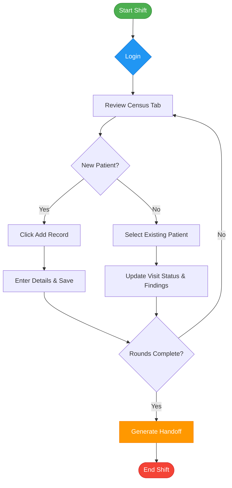
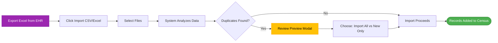
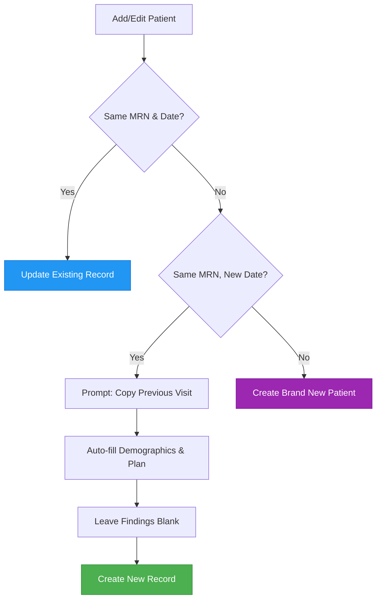

# Clinical Rounding Platform - User Guide

Welcome to the Clinical Rounding Platform! This guide walks you through using the application to manage patient census, rounds, and scheduling.

## Table of Contents

1. [Infographics & Workflows](#infographics--workflows)
2. [Getting Started](#getting-started)
3. [Dashboard Overview](#dashboard-overview)
4. [Managing Patients](#managing-patients)
5. [Tabs & Views](#tabs--views)
6. [Import Files & Reports](#import-files--reports)
7. [On-Call Scheduling](#on-call-scheduling)
8. [Tips & Keyboard Shortcuts](#tips--keyboard-shortcuts)
9. [Troubleshooting](#troubleshooting)

---

## Infographics & Workflows

### 🔄 Daily Rounding Workflow


### 📥 Bulk Import Process


### 🧠 Same-Patient Visit Logic


---

## Getting Started

### Login

The app uses your organizational account for secure access.

1. Open the app in your browser
2. Click **Login** in the top action bar
3. Enter your organizational email (e.g., `john.smith@yourdomain.com`)
4. Enter your password
5. Approve multi-factor authentication (MFA) if prompted
6. You're in! ✅

**Note**: On first login, you may see "Local Mode" until credentials are configured. The app works in both modes: local storage for immediate use and cloud sync through M365/SharePoint when configured. After authentication, the same top-bar button changes from **Login** to **Logout**.

### Your First Look

Once logged in, you'll see:

- **Status indicator** - "Connected (M365)" or "Local Mode" or "Offline"
- **Quick stats** - Active patients, procedures, archived counts
- **Tab navigation** - Jump between Census, Surgical, Calendar, Staffing, Archive, Timeline, Analytics, Reports, Audit, Procedures, Shifts
- **Top action bar** - Login/Logout, Import Files, Add Record, Adv. Filters, Search, Settings, Help
- **Search + Adv. Filters** - Find patients instantly and narrow with presets, dates, statuses, and hospitals
- **Patient table** - All active patients with sorting and filtering

### Connection Modes

The app has three modes depending on your setup:

| Mode | Status | Features | Persistence |
|------|--------|----------|--------------|
| **Cloud (M365)** | 🟢 Connected (M365) | Real-time sync, multi-user, full features | SharePoint Lists (permanent) |
| **Local Mode** | 🟡 Local Mode | Full app features, fast, offline-ready | Browser storage (this session) |
| **Offline** | ⚫ Offline | View cached data, add locally, sync on reconnect | localStorage + IndexedDB |

**For admins**: If you see "Local Mode", your M365 credentials may not be configured yet. Contact your IT administrator.

### Visit Workflow Statuses

| Status | Color | Meaning | Icon |
|--------|-------|---------|------|
| **NEW CONSULT** | Slate | New consult visit | NC |
| **SURGICAL PATIENT (SAME DAY SURGERY)** | Blue | Active same-day surgical workflow | SDS |
| **NEW SURGICAL PATIENT (AM ADMIT)** | Cyan | New AM surgical admit | AM |
| **FOLLOW UP (CONSULT)** | Green | Non-post-op follow-up visit | FU |
| **FOLLOW UP (POST OP)** | Amber | Post-op follow-up | PO |
| **TO BE DISCHARGED/SIGNED OFF** | Rose | Ready to sign off or discharge | DC |
| **STAT** | Bright Red | Urgent/Priority (entire card goes red) | 🔴 |

**STAT Priority Visual**: When you toggle STAT priority ON in the patient form, the entire "Stat Acuity" card becomes bright red with a thick dark border and red glow effect. This makes urgent cases impossible to miss.

---

## Dashboard Overview

The main screen provides an overview of patient census and status.

### Key Sections

- **Status Indicator**: Shows connection status (Connected/Offline) and data persistence mode
- **Patient Stats**: Quick counts at a glance (Active, Procedures, Archived)
- **Tab Navigation**: Access different views and tools (11 tabs available)
- **Search + Adv. Filters**: Keyword search panel plus advanced filter presets and detailed checkboxes
- **Patient Table/View**: Multiple view modes available
- **Batch Operations**: Select multiple patients for bulk actions inside Selection Mode

### Search & Quick Filters

**🔍 Search** (Ctrl/Cmd+/):
- Search by name, MRN, room, hospital, plan, or findings
- Results update in real time as you type
- The Search panel also contains the quick-filter buttons below

**🔽 Adv. Filters** (Ctrl/Cmd+Shift+F):
- Open saved presets such as Morning Rounds, Post-Op Check, STAT Cases, and Pending Tests
- Filter by date range, hospital, status, and priority
- Combine Adv. Filters with Search when quick buttons are not enough

**Quick Filter Buttons**:
- **🔴 STAT Only** - Show only urgent/priority patients
- **🔵 Procedures** - Surgical cases only
- **⚡ In Progress** - Currently active patients
- **📋 Pending Tests** - Waiting on labs or imaging
- **Clear** - Reset all filters

### Patient Table Columns

- **Room**: Patient room number
- **Date**: Admission or current round date
- **Hospital**: Facility (AWC, BTMC, WGMC, etc.)
- **Name**: Patient name
- **Findings**: Clinical notes (abbreviated)
- **Plan**: Treatment plan (abbreviated)
- **MD**: Supervising physician
- **Status**: Visit workflow status dropdown for quick changes

### View Modes

The app offers three ways to view patient data:
- **📊 Table View** - Traditional table format with all columns
- **🃏 Card View** - Visual cards with patient info, easier to scan
- **🏥 By Hospital** - Grouped by facility for better organization

---

## Managing Patients

### Adding a New Patient

1. Click **Add Record** in the top action bar
2. Fill in the form fields:
   - **Room** - Room number (required)
   - **Date** - Today's date (or select a different date)
   - **Hospital** - Select from dropdown
   - **Name, DOB, MRN** - Patient demographics
   - **Findings** - Clinical assessments
   - **Plan** - Treatment plan
   - **Supervising MD** - Attending physician
   - **Pending** - Lab work, imaging, procedures
   - **Follow-Up** - Follow-up appointments
   - **STAT Priority** - Toggle for urgent cases (shown as red block label in form)
   - **Procedure Status** - NEW CONSULT, SURGICAL PATIENT (SAME DAY SURGERY), NEW SURGICAL PATIENT (AM ADMIT), FOLLOW UP (CONSULT), FOLLOW UP (POST OP), or TO BE DISCHARGED/SIGNED OFF
   - **Billing Codes** - CPT/ICD codes (if you have billing permissions)

3. Click **Save** to add the patient
4. You'll see a success message: "✓ Saved"

#### Understanding Visit Keys & Same-Patient Records

**What is a Visit Key?**

The app uses a "Visit Key" system where each patient visit is uniquely identified by:
- **Patient MRN** + **Visit Date**

**This means:**
- Same patient, **different date** = **New separate record**
- Same patient, **same date** = **Update the existing record** (no duplicate)

**Real-World Examples:**

| Scenario | Result |
|----------|--------|
| Jan 16: See patient John (MRN 12345), findings "UTI suspected" | ✅ New record created for Jan 16 |
| Jan 18: See same patient, findings now "UTI confirmed" | ✅ New separate record created for Jan 18 |
| Jan 16 again: Update findings to "UTI ruled out" | ✅ Same record updated (no duplicate created) |

**Why This Matters:**
- ✅ No accidental duplicates for same patient on same day
- ✅ Each visit date is tracked separately
- ✅ Findings stay up-to-date for each visit
- ✅ You can see history across multiple visits

**"Copy from Previous Visit" Feature:**

When adding the same patient on a new date, click: **"Copy from Previous Visit"**

This auto-fills:
- ✅ Room, Hospital, Name, DOB, MRN
- ✅ Treatment Plan, Supervising MD
- ❌ **Does NOT copy**: Findings, Pending tests, Follow-ups (fresh per visit)

**Pro Tip**: Use this when rounding on the same patient across different days!

### Editing a Patient Record

1. Click on a patient row in the table
2. The patient modal will open with all current data
3. Modify any fields needed
4. Click **Save**

### Viewing Full Details

Click on a patient row to open the modal and see all information, including:
- Extended findings notes
- Complete plan details
- Pending tests and procedures
- Follow-up instructions
- Billing codes (if accessible)

### Quick Status Updates

Without opening the full patient form:

1. Find the patient in the table
2. Use the **Status dropdown** (rightmost column)
3. Select the new workflow status from the six current visit-status options
4. Status updates instantly

### Selection Mode

When you select one or more rows with the table checkboxes, the app enters **Selection Mode**.

- A sticky batch bar appears with **Print Selected**, **Change Status**, **Archive**, **Delete**, and **Clear Selection**
- The app stays locked to **Census** and **Table View** until you clear the selection
- You can keep scrolling the table and keep selecting or unselecting rows
- **Change Status** prompts for the new workflow status and then requires a change note before saving

### Archiving a Patient

When a patient is discharged or no longer needs active monitoring:

1. Click on the patient to open the modal
2. Click the **Archive** button (red button, if admin)
3. Patient moves to the Archive tab
4. To restore, open from Archive tab and click **Restore**

### Deleting a Patient

⚠️ **Permanent deletion** - Only administrators can delete records.

1. Open patient modal
2. Click **Delete** (red button, admin only)
3. Confirm the deletion dialog
4. Record is permanently removed

---

## Tabs & Views

The application has **11 tabs** to manage different aspects of patient care and scheduling.

### The Census Tab
**Keyboard Shortcut**: Alt+A

The Census tab shows all **active, ongoing patient records**.

#### What You'll See

- All patients admitted today or before
- Active treatments and follow-ups
- Sorting: Patients are sorted by STAT priority first, then by date
- Batch selection: Select multiple patients for bulk operations

#### Typical Workflow

1. **Morning Rounds**: Review all patients, update findings
2. **During Rounds**: Quick status changes via dropdown
3. **Add New Patients**: Click **Add Record** as they arrive
4. **End of Day**: Review pending items, archive discharged patients

#### Batch Operations

Select patients using checkboxes on the left, then:
- **Print Selected** - Open a print-friendly view for the selected records
- **Change Status** - Update visit workflow status for selected patients
- **Archive** - Move to Archive tab
- **Delete** - Permanently remove (admin only)
- **Clear Selection** - Exit Selection Mode

**Important**: While rows are selected, the app locks to **Census** and **Table View** so batch actions stay predictable.

### The Surgical Tab
**Keyboard Shortcut**: Alt+S

The Surgical tab shows only **procedures and surgical cases** (filtered by keywords: cysto, stent, TURBT, laser, surgery, etc.).

#### Use Cases

- **OR Board**: View what's scheduled vs. completed
- **Procedure Tracking**: Follow pre-op, operative, and post-op phases
- **Coordination**: See which procedures are planned vs. in progress

#### Common Surgical Workflow

1. **NEW CONSULT** - Initial evaluation
2. **SURGICAL PATIENT (SAME DAY SURGERY)** or **NEW SURGICAL PATIENT (AM ADMIT)** - Active surgical workflow
3. **FOLLOW UP (POST OP)** - Post-operative monitoring and follow-up
4. **TO BE DISCHARGED/SIGNED OFF** - Ready for discharge or sign-off

#### Filtering

The surgical tab **auto-filters** based on keywords in findings or plan. If your patient doesn't appear, it means the keywords didn't match. You can still add it manually to the Census tab.

### The Calendar View
**Keyboard Shortcut**: Alt+C

The Calendar tab displays a **monthly overview** of patient admissions and procedures.

#### Calendar Features

- **Red dots** = Procedures/surgeries scheduled
- **Federal holidays** = Marked with emoji (🎄 Christmas, 🦃 Thanksgiving, etc.)
- **Click date** = See all patients admitted/discharged that day
- **Month navigation** = Use arrows to go to previous/next months

#### Use Cases

- **Weekly Planning**: See OR schedule at a glance
- **Staffing**: Identify busy days for on-call coordination
- **Historical View**: Review what happened last month
- **Holiday Planning**: Know when key dates fall

### The Staffing Tab
**Keyboard Shortcut**: Alt+F

The Staffing tab manages **physician on-call coverage** and provides scheduling overview.

#### Add On-Call Assignment

1. Click **Staffing** tab
2. Click **+ Add Schedule**
3. Enter:
   - **Date** - On-call date
   - **Provider** - Physician name (e.g., "Jain", "Larsen")
   - **Hospitals** - Comma-separated list (e.g., "WGMC, AWC, BTMC")
4. Click **Save**

#### Auto-Fill Features

When you open the Staffing tab:
- **Provider name** auto-fills from your last entry (or global default)
- **Date** auto-fills with today's date
- **Hospital checkboxes** auto-check if you were on-call at those locations

#### View Schedule

- The calendar shows all on-call assignments
- Color-coded by provider (if configured)
- Sort by date or provider

### The Archive Tab
**Keyboard Shortcut**: Alt+X

The Archive tab stores **discharged and inactive patients**.

#### Archiving a Patient

When a patient is discharged or no longer needs active monitoring:

1. Click on the patient to open the modal (Census tab)
2. Click the **Archive** button (bottom of form)
3. Patient moves to the Archive tab
4. To restore, open from Archive tab and click **Restore**

#### Viewing Archived Records

- All archived patients listed here
- Same view modes available (Table, Card, By Hospital)
- Click to view full details or restore

### The Timeline Tab

The Timeline tab shows patient events **chronologically**.

#### Controls

1. **MRN filter** - Enter patient MRN to focus timeline to one patient
2. **From date** - Set start date for history window
3. **Load Timeline** - Fetch and render matching events

#### Use Cases

- **Patient History**: See all visits for a specific patient
- **Trend Analysis**: Identify patterns over time
- **Follow-up Tracking**: Review historical visit notes

### The Analytics Tab

The Analytics tab provides **prebuilt analyses and custom query mode**.

#### Preset Analyses

The app provides quick insights:
1. **Census Overview** - Active census, procedures, STAT cases, pending tests
2. **Procedure Pipeline** - Procedure volume and status distribution
3. **Hospital Workload** - Census by hospital, identify busiest sites
4. **Risk and Pending Focus** - High-attention cohort, length-of-stay context

#### Custom Query Mode (Validated)

Use format: `key:value`

**Allowed keys**:
- `hospital` - Filter by facility (e.g., `hospital:WGMC`)
- `procedureStatus` - Filter by visit workflow status (e.g., `procedureStatus:FOLLOW UP (POST OP)`)
- `mrn` - Find specific patient (e.g., `mrn:12345`)
- `name` - Search by patient name (e.g., `name:Smith`)
- `date` - Filter by date (e.g., `date:2026-01-18`)
- `stat` - Show STAT cases only (e.g., `stat:true`)

The app validates format before executing and blocks invalid queries with helpful feedback.

### The Reports Tab

The Reports tab provides a **PDF report workflow** with on-page preview.

#### Available Reports

- **Daily Rounding** - Current patient count and visit status
- **Surgical Procedures** - Surgical cases and outcomes
- **Patient Summary** - Patient-level summary view
- **Hospital Census** - Bed usage by facility

#### Export Options

- Click **Generate PDF** to build the report preview in-page
- Use **Print** for the browser print dialog
- Use **Download PDF** to save the generated report

### The Audit Tab

The Audit tab logs **system access and data changes** (admin view).

#### What's Logged

- Who accessed/modified patient records
- When changes occurred
- What was changed and by whom
- Access attempts (including failed logins)

#### Use Cases

- **Compliance**: HIPAA audit trail documentation
- **Troubleshooting**: Track who made changes
- **Accountability**: Review access history per user

#### Audit Controls

- **Date range filter** - View specific time periods
- **User filter** - See changes by specific staff
- **Action filter** - Show only creates, updates, or deletes
- **Export** - Download audit logs for compliance review

### The Procedures Tab

The Procedures tab provides **detailed procedure tracking** separate from census.

#### View Details

- All surgeries and procedures with timeline
- Start time, end time, provider, location
- Complication tracking (if enabled)
- Post-op notes and discharge criteria

#### Procedure Status Tracking

- **NEW CONSULT** - Initial evaluation
- **SURGICAL PATIENT (SAME DAY SURGERY)** - Same-day surgical case
- **NEW SURGICAL PATIENT (AM ADMIT)** - AM surgical admit
- **FOLLOW UP (POST OP)** - Post-op monitoring
- **TO BE DISCHARGED/SIGNED OFF** - Discharge/sign-off stage

### The Shifts Tab

The Shifts tab shows **on-call and shift coverage** at a glance.

#### View Options

- **Weekly view** - See all providers for the week
- **Monthly view** - Full month coverage grid
- **Provider view** - See individual's schedule
- **Hospital view** - Coverage by facility

#### Gap Identification

The system highlights:
- 🔴 **Gaps** - Days with no coverage
- 🟡 **Conflicts** - Same provider assigned multiple times
- ✅ **Full Coverage** - All days covered

---

## Import Files & Reports

### Import Census from Excel

Use this to bulk-load patients from an Excel/CSV file.

#### Supported Format

Your CSV file should have:
- **Row 1-3**: On-call provider information (optional)
- **Row 4**: Column headers (Room, Date, Name, DOB, MRN, Findings, Plan, MD, Pending, Follow-Up)
- **Row 5+**: Patient data rows
- **Section headers**: Hospital names (e.g., "Abrazo West", "BEMC") with rest of row empty

#### How to Import

1. Prepare your CSV file following the format above
2. Click **📥 Import Files** button
3. Select one or more files (CSV, XLSX, or XLS)
4. **Preview Modal Opens** showing:
   - Total files selected
   - Count of NEW records (will be added)
   - Count of DUPLICATES (same MRN + date already exist)
   - Per-file breakdown
5. **Choose action**:
   - **✓ Import All** - Add new records + replace duplicates with file data
   - **✓ Import New Only** - Add new records, skip duplicates (preserve existing)
   - **✗ Cancel** - Don't import anything
6. The app will:
   - Parse on-call assignments from rows 1-3
   - Detect hospital sections automatically
   - Create patient records (based on your choice)
   - Show progress and success count

#### Bulk Import (Multiple Files)

You can import multiple workbooks at once:

1. Click **📥 Import Files**
2. Hold Ctrl (Windows) or Cmd (Mac) and select multiple files
   - Example: Select `2024.xlsx`, `2025.xlsx`, `2026.xlsx`
3. The app processes **all sheets** in **all files** automatically
4. Preview shows aggregated summary across all files
5. Choose import action (Import All or New Only)
6. All files imported in seconds

**Use Case - Historical Data**: Import 3 years of workbooks in one operation instead of one-by-one.

#### Duplicate Detection

The app prevents duplicate records using **compound key**: `MRN + Date`

**Examples**:
- File has: MRN 12345, Date 2025-01-16 → Already exists → **DUPLICATE** ⚠️
- File has: MRN 12345, Date 2025-01-17 → Not in system → **NEW** ✅
- File has: MRN 99999, Date 2025-01-16 → Not in system → **NEW** ✅

**When to use "Import All"**: File has corrected/updated data, you want to replace existing records

**When to use "Import New Only"**: Preserve existing data, only add new patients

#### Example CSV Structure

```
,Date of Service,PROVIDER ON CALL,ON CALL AT HOSPITALS
Physician On-Call:,2026-01-12,Jain,"WGMC, AWC"
Physician On-Call:,2026-01-13,Larsen,"BTMC"

Hospital/Room #,Date of Service,Name,DOB,MRN,Findings,Plan,Supervising MD,Pending,Follow-Up
Abrazo West,,,,,,,,
251,2026-01-12,Smith,1960-05-15,12345,"mild hydro","Foley","Jain","CBC pending","2 wks"
BEMC,,,,,,,,
5039,2026-01-12,Jones,1955-03-20,54321,"hematuria","Stent removal","Pandey","Imaging","1 week"
```

### PDF Reports Export

The current visible export workflow is inside the **Reports** tab.

#### How to Export a Report

1. Open **Reports**
2. Choose a report type
3. Optionally filter by date and hospital
4. Click **Generate PDF**
5. Review the preview
6. Click **Print** or **Download PDF**

#### Current Report Types

- **Daily Rounding**
- **Surgical Procedures**
- **Patient Summary**
- **Hospital Census**

---

## On-Call Scheduling

The Staffing tab manages **physician on-call coverage**.

### Add On-Call Assignment

1. Click **Staffing** tab
2. Click **+ Add Schedule**
3. Enter:
   - **Date** - On-call date
   - **Provider** - Physician name (e.g., "Jain", "Larsen")
   - **Hospitals** - Comma-separated list (e.g., "WGMC, AWC, BTMC")
4. Click **Save**

### View Schedule

- The calendar shows all on-call assignments
- Color-coded by provider (if configured)
- Sort by date or provider

### Edit Assignment

1. Click on a date with an assignment
2. Modify the provider or hospitals
3. Click **Save**

### Delete Assignment

1. Find the assignment
2. Click **Delete** (admin only)
3. Confirm deletion

---

## Tips & Keyboard Shortcuts

### Keyboard Shortcuts

**Patient Management**:
- `Ctrl+N` (or `Cmd+N`) - New record
- `Ctrl+E` (or `Cmd+E`) - Export to Excel
- `Ctrl+P` (or `Cmd+P`) - Print selected records

**Tab Navigation**:
- `Alt+A` - Census tab
- `Alt+S` - Surgical tab
- `Alt+C` - Calendar tab
- `Alt+F` - Staffing tab
- `Alt+X` - Archive tab

**App Controls**:
- `Ctrl+/` (or `Cmd+/`) - Search panel
- `Ctrl+Shift+F` (or `Cmd+Shift+F`) - Adv. Filters panel
- `Ctrl+,` (or `Cmd+,`) - Settings panel
- `Ctrl+?` (or `Cmd+?`) - Show all shortcuts
- `↑` - Scroll up or move to the previous visible record
- `↓` - Scroll down or move to the next visible record
- `Escape` - Close search, settings, or help

### Mobile Tips

- **Landscape mode**: Wider table view, easier to read
- **Swipe left/right**: Navigate between tabs on mobile
- **Tap and hold**: Right-click menu on some devices (if supported)
- **Tap row**: Open patient details
- **Status dropdown**: Quick-change visit workflow status without opening full form

### Desktop Tips

- **Click to select**: Use checkboxes to select multiple patients for batch operations
- **Drag columns**: Resize table columns (coming soon)
- **Click headers**: Sort by any column
- **Double-click row**: Quick-edit mode for fast updates

### Data Entry Tips

- **Room number**: Use `ER` for emergency department, `5039` for inpatient
- **MRN**: Unique per patient across system; use consistently
- **Date**: Leave as today unless importing historical data
- **Findings**: Use bullet points or abbreviations (e.g., "L hydro, 2mm stone, S/P CRULLS 12/20")
- **Plan**: Be specific (e.g., "Cysto/stent removal 12/28 @ 2pm", not just "Follow-up")

### Search Tips

- Use **Search** (Ctrl+/) for quick filtering
- Use **Adv. Filters** (Ctrl+Shift+F) for presets, date ranges, and status filters
- Combine Search with quick buttons such as **STAT Only**, **Procedures**, and **Pending Tests**
- Search works across all fields: name, MRN, findings, plan, hospital
- Results update in real-time as you type

### Offline Usage

- **Cached data**: App caches recent patients automatically
- **No internet**: You can view, edit, and add patients locally
- **Status**: Shows "Offline" or "Local Mode" in status area
- **Reconnect**: When online, changes sync automatically
- **Data safety**: Changes are saved locally until connection restored

---

## Troubleshooting

### "Can't log in"

**Problem**: You see "Unauthorized" or can't access the app.

**Solutions**:
1. Verify you're using your **organizational email** (e.g., firstname.lastname@yourhospital.org)
2. Check **Caps Lock** isn't on
3. Request your IT admin to verify your role assignment in Entra ID
4. Clear browser cache and try again
5. Try a different browser

### "Offline mode" appears unexpectedly

**Problem**: Status says "Offline" but you have internet.

**Solutions**:
1. Check your **internet connection**
2. Verify the **API is reachable**: Ask your IT admin if Azure Functions are running
3. Check browser **console** (F12) for error messages
4. Try **refreshing** the page
5. Restart your app and browser

### "Can't save patient"

**Problem**: You click Save but nothing happens or you see an error.

**Solutions**:
1. Verify **required fields** are filled:
   - Room (required)
   - Date (required)
2. Check for **duplicate**: If patient with same MRN + date exists, you'll get "Patient already rounded today"
   - Use **Copy from Previous Visit** to add a new date's visit
3. If billing codes show errors, you may not have **billing permissions** (expected for clinicians)
4. Check your **internet connection**

### "Can't generate a PDF report"

**Problem**: The Reports tab does not build a preview or the PDF download is unavailable.

**Solutions**:
1. Make sure the selected date and hospital still return matching records
2. Change the report type and try **Generate PDF** again
3. Refresh the page and reopen the Reports tab
4. Check browser console errors if the preview area stays blank
5. If the issue persists, contact support with the report type and filters you used

### "Data not syncing"

**Problem**: Changes made by another user aren't showing up.

**Solutions**:
1. Click the **refresh button** (status area) or wait 15 seconds
2. Close and reopen the patient record
3. Fully **refresh the page** (Ctrl+R or Cmd+R)
4. Check that both users are **online and connected**
5. If problem persists, verify the API backend is running

### "Copy from Previous Visit not working"

**Problem**: Button doesn't show or doesn't populate fields.

**Solutions**:
1. Verify the **MRN field** is filled with the patient's ID
2. Ensure this patient has a **previous visit** in the system
3. If MRN is blank, the button is disabled (expected)
4. Check that you're trying to add a **new date** (different from previous visit date)

### "Can't see billing codes"

**Problem**: CPT/ICD fields are hidden or show `***`.

**Solutions**:
1. This is **normal for clinicians** - field masking is intentional for HIPAA
2. If you need billing access, ask your department administrator to assign you the **"billing" role**
3. Once role is changed, sign out and sign back in to see the fields

### Performance Issues

**Problem**: App is slow, fields lag when typing.

**Solutions**:
1. **Close other tabs/apps** to free up memory
2. **Clear browser cache** (Settings → Clear browsing data)
3. Try a **different browser** to isolate the issue
4. On mobile, **close other apps** and restart the device
5. Contact IT if the issue persists

### "Patient still shows after archiving"

**Problem**: Patient appears in both Census and Archive tabs.

**Solutions**:
1. Refresh the page (Ctrl+R)
2. Close and reopen the app
3. Wait 15 seconds for sync (polling interval)
4. Archive again if still visible

---

## Getting Help

### In-App Help

- Click the **Help** button in the top action bar for the shortcuts modal
- Hover over field labels for tooltips (coming soon)
- Status messages at the bottom give real-time feedback

### Contact Support

- **IT Help Desk**: For login, permissions, or connection issues
- **Application Admin**: For feature requests or data questions
- **Email**: Send issues to your department's app administrator

### Providing Feedback

Your feedback helps improve the app:

1. Note the date, time, and what you were doing
2. Include error messages or screenshots
3. Send to your department's app administrator

---

## FAQ

**Q: Can I use the app on my personal phone?**  
A: Yes, if it has a web browser and internet. Your organizational account login is required for security.

**Q: What happens if I close the browser while editing?**  
A: Unsaved changes are lost (this is expected web app behavior). Make sure to click Save before closing.

**Q: Can I edit archived patients?**  
A: Yes, open from Archive tab and make changes. Click Save to update.

**Q: How long is data kept?**  
A: According to your hospital's data retention policy. Ask your IT admin.

**Q: Can I access this app from outside the hospital network?**  
A: Yes, the app is cloud-based. Only your organizational login is required.

**Q: How do I print a patient record?**  
A: Select rows and use **Print Selected** in Selection Mode, or use the **Print** action from the Reports preview.

**Q: Is my data encrypted?**  
A: Yes, all data is encrypted in transit (HTTPS) and at rest in SharePoint. Access is audited and logged.

**Q: What's the "Copy from Previous Visit" button?**  
A: It copies all data from the patient's last visit except findings, pending items, and follow-up (those are assumed to be new for each visit). Saves time entering repetitive info.

**Q: What's "Local Mode" vs "Connected (M365)"?**  
A: Local Mode = App works in your browser without cloud sync (fast, no setup). Connected = Data syncs to M365/SharePoint (shared team access). Contact IT admin to enable M365 mode.

**Q: How do I create a patient on multiple dates?**  
A: Same patient, different date = new visit record. Use "Copy from Previous Visit" to speed up data entry for repeat patients.

**Q: What does "Import New Only" vs "Import All" mean?**  
A: **Import New Only** = Add new records, skip duplicates (safe if unsure). **Import All** = Add new + replace duplicates with file data (use for corrections). See "Bulk Import (Multiple Files)" section for examples.

---

## Version History

**v2.0** (Mar 2026) - Enhanced UI & Advanced Features
- Added 11 tabs including Timeline, Analytics, Reports, Audit, Procedures, Shifts
- Implemented batch operations (select, change status, archive, delete)
- Added advanced search with quick filters
- Multiple view modes (Table, Card, By Hospital)
- Dark mode and accessibility features
- Enhanced keyboard shortcuts
- Bulk import preview with duplicate detection

**v1.0** (Jan 2026) - Initial M365 Migration
- Migrated from Firebase to M365/SharePoint backend
- Added MSAL.js authentication (Entra ID)
- Improved offline caching and polling
- Added hospital field and CSV import
- Added OneDrive Excel export
- "Copy from Previous Visit" feature

---

**Last Updated**: April 9, 2026

For the latest version of this guide, check your app's Help section or contact your administrator.
